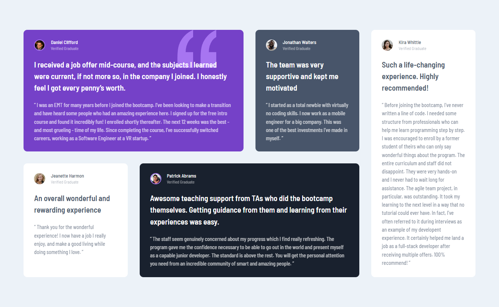

# pablodev - Testimonials grid section solution

This is a solution to the [Testimonials grid section challenge on Frontend Mentor](https://www.frontendmentor.io/challenges/testimonials-grid-section-Nnw6J7Un7). Frontend Mentor challenges help you improve your coding skills by building realistic projects. 


## Overview

### The challenge

Users should be able to:

- View the optimal layout for the site depending on their device's screen size

### Screenshot




### Links

- Solution URL: [Add solution URL here](https://your-solution-url.com)
- Live Site URL: [Add live site URL here](https://your-live-site-url.com)

## My process

### Built with

- Semantic HTML5 markup
- Flexbox
- CSS Grid
- Mobile-first workflow


### What I learned


This was the biggest challenge for me so far, I still didn't know how to use the CSS grid and this challenge made me chase that knowledge!


```css
.cards {
  grid-template-columns: 45px auto;
  grid-template-rows: 16px 16px auto minmax(auto, 1fr);
}
```

### Continued development

I intend to continue improving myself in frontend, especially in semantics, responsiveness and interactivity

### Useful resources

- [Extension Mobile First](https://chromewebstore.google.com/detail/mobile-simulator-responsi/ckejmhbmlajgoklhgbapkiccekfoccmk?hl=pt-PT&utm_source=ext_sidebar) - This is my favorite google extension, You can see your web site in a mobile device, this is pretty good!


## Author

- Website - [pablodev](https://pabloodev.github.io/portifolio-pablo/)
- Frontend Mentor - [@pablodev](https://www.frontendmentor.io/profile/Pabloodev)


<hr>
Thank you so much guys! 😊
<hr>
